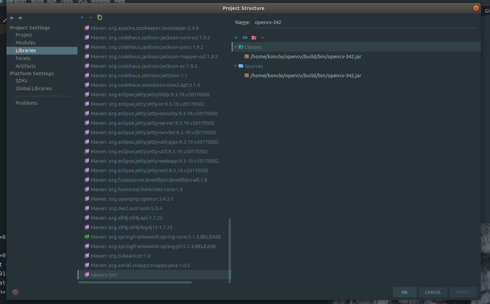
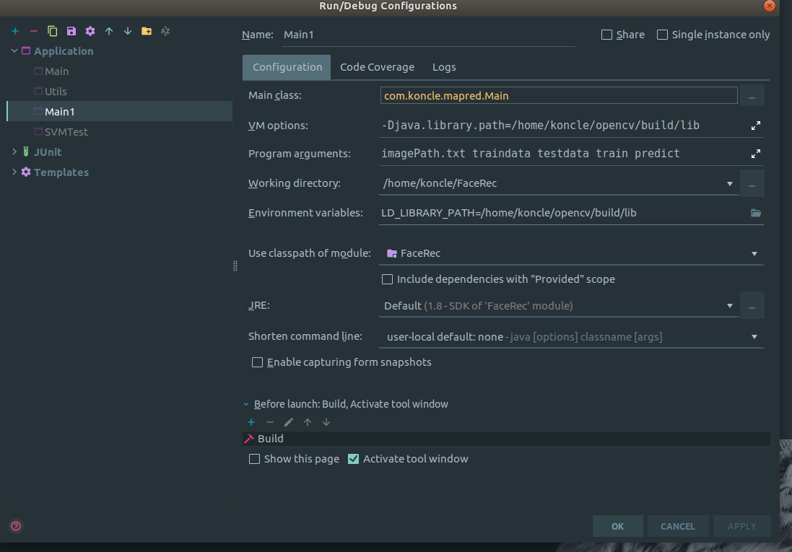

# Opencv + Hadoop

## 文件说明

blocks : 存放各种封装好的类
- Main : 用于测试svm，和生成对应的图片索引文件
- DataProcessor : 读取图片，对图片进行预处理，生成对应的特征向量(Opencv 的封装)
- ImageFolder : 读取某个文件夹中的图片及其对应类，用于本地图片的测试，及图片索引的输出
- FaceSVM : 对Opencv SVM的封装（这里的SVM不是增量更新的）
- Utils : 读取、写入本地或HDFS文件，
- SVMTest : 参考的别人的SVM代码

mapred : mapreduce程序
- Main : mapreduce driver程序
- MatWritable : 自定义的一个用于mapreduce Mapper 和 Reducer传输 Opencv Mat类的 类
- PreProcess : 输入 imagePath.txt， 对其中的图片进行读取、增广、pca、转换成 1 * n 的特征, 然后保存在文件中
- Train : 对Preprocess的输出的预处理好的数据集进行训练，并保存SVM模型文件
- Predict : 读入保存好的SVM模型文件，并对Preprocess处理好的测试文件进行预测

hadoop运行参数 imagePath.txt traindata testdata train predict
分别是  输入图片索引文件 训练数据保存文件夹 测试数据保存文件夹 训练保存文件夹 预测保存文件夹
         
## 处理流程

1. 对图片进行缩放、增广、使用PCA对图片进行特征抽取，保存预处理后的数据
2. 用SVM对训练数据进行训练，保存模型
3. 读取保存的模型，对测试数据进行预测，并输出每个类(人名)对应的图片id

## 完成项目

1. 图片的预处理操作
2. svm训练、保存、预测
3. mapreduce的整个流程
4. 本地(不采用hadoop jar的方式调用)测试，能够完成整个处理流程，并生成对应文件

## 未完成和待改进的项目

1. **主要问题**，使用hadoop jar方式调用时，opencv的接口出现问题：
   1. blocks/DataProcessor.java 中使用 imread 读取出错，原因未知(可能是与hdfs有关)
   2. blocks/FaceSVM.java 中使用 SVM.create() 出错，原因未知
   
2. 除了上述大错误外，还需要改进的是：
   1. 将训练集与测试集划分开，可以在ImageFolder的writeFile方法中生成两个图片索引文件，分别用于训练核测试
   2. 图片目前保存在本地，可以尝试放到hdfs上进行读取，可以替换上述主要问题1的imread接口，从而解决错误
       (可能需要用别的java包)
   3. 预处理时，只生成了一个图片，可以生成多个图片，由于图片的id需要不同（不过也不是必须），可以用一个静态变量
      (需要增加一个输入文件来获得最大的图片id)来为增广后的图片的id赋值。
   4. mapred/Train 中 SVM模型保存太过耗时，
   
## 运行环境

java 1.8 可修改pom.xml文件来更改版本
opencv 3.4 linux系统下需要自己编译生成so库文件，具体过程见下面
hadoop 3.1.1

### linux下安装opencv

```bash
$ git clone  https://github.com/opencv/opencv.git
$ cd opencv
// 切换到 3.4.0版本进行编译
$ checkout 3.4.2  
```

创建脚本 install.sh，内容如下

```bash
$ rm CMakeCache.txt
$ mkdir build
$ cd build
$ cmake .. -DCMAKE_BUILD_TYPE=RELEASE -DCMAKE_INSTALL_PREFIX=/usr/local 
$ make
$ make install
$ make clean
```

执行该脚本，时间比较长。

再执行以下命令安装java环境

```bash
// 安装 ant 包
$ sudo apt-get install ant
$ cd build
$ cmake -DCMAKE_BUILD_TYPE=RELEASE -DCMAKE_INSTALL_PREFIX=/usr/local -DBUILD_TESTS=OFF ..
$ make -j8
$ sudo make install 
```

此时在 opencv/build/bin 下应该有opencv-342.jar出现。

在 IDEA 中的 project structure 中的 libraries 导入该 jar包。
再在 vm option 中输入 -Djava.library.path=/你的路径/opencv/build/lib 来使jvm找到动态链接库。





Hadoop运行时，需要 

```bash
$ export HADOOP_OPTS="$HADOOP_OPTS -Djava.library.path=/你的路径/opencv/build/lib"
```

来让hadoop找到该动态链接库。